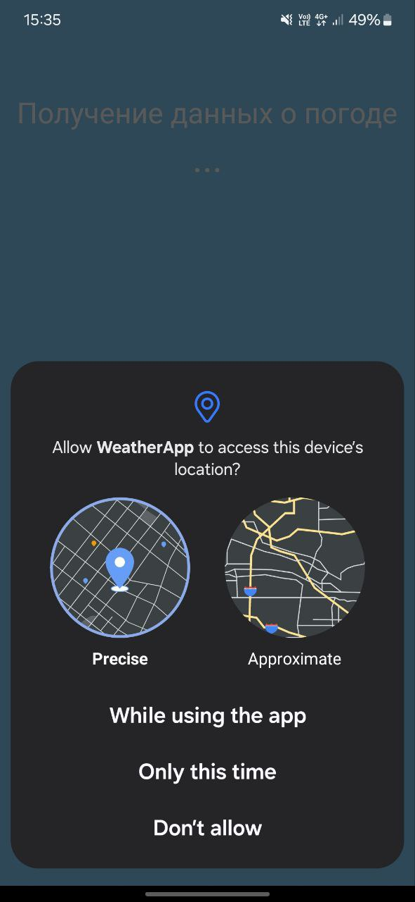
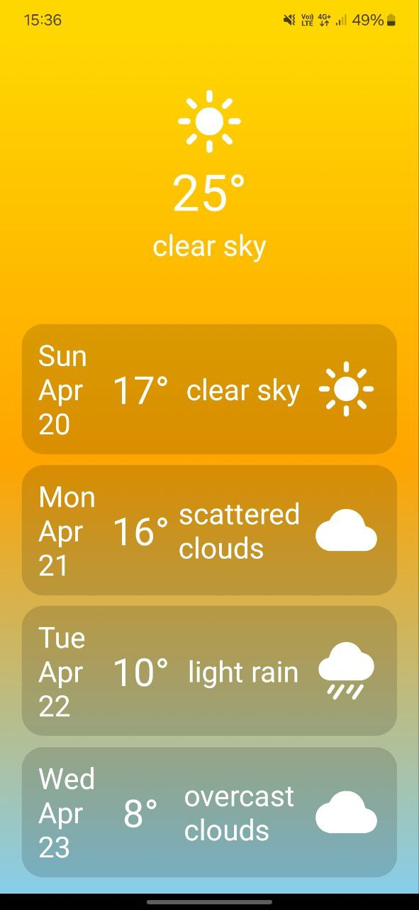

# 🌦 Weather App (React Native)

Приложение для отображения текущей погоды и прогноза на 4 дня. Разработано на React Native с использованием API OpenWeatherMap.

## 🚀 Функциональность

- Получение геолокации пользователя
- Отображение текущей погоды
- Прогноз на 4 дня
- Иконки погоды, цветовая тема в зависимости от условий
- Градиентный фон, адаптивный интерфейс

## 🛠️ Технологии

- [React Native](https://reactnative.dev/)
- [Expo](https://expo.dev/)
- [Axios](https://axios-http.com/)
- [OpenWeatherMap API](https://openweathermap.org/api)
- [Expo Location](https://docs.expo.dev/versions/latest/sdk/location/)
- [Ionicons](https://ionic.io/ionicons)

## 📱 Скриншоты

<p align="center">
  
  
  
</p>


## Установка и запуск

1. Установка зависимостей

   ```bash
   npm install
   ```

2. Запуск приложения

   ```bash
    npx expo start
   ```

